The Task:
## 理解任务
与感知任务相比，三维重建任务在输入和输出上相反。三维重建任务多是在已经对场景（或人）有了语义上的理解后，把语义的理解作为输入，预测传感器收集到的数据是如何的。如果说感知模型训练得到的是一个游客，那么重建模型训练的结果就是一个画家。

以三维人体重建任务为例，它要解决的问题就是根据已知的动作预测人体软组织的位置、形状变化。三维人体重建首先把重建的结果拆分为一个可以量化的数学模型，这个数学模型由人体的关节和软组织组成。在人体运动的过程中，骨骼的位置、朝向变化是好描述的。因为他们可以被诗作刚体，但是软组织的变化往往很难描述，而且人体的软组织对于视觉感知有决定性的作用。

## 蒙皮重建方法
在建模人体软组织的流派中，我正在pre-research的是蒙皮，他们把软组织建模成许多块顶点，并且每个软组织对于关节有着依附的关系。因此，三维人体的重建任务被转化成了预测多个软组织的顶点，而三维重建模型，就成为了输入一个人的运动姿态、依据已有的人体软组织参数、人体骨骼参数，预测运动姿态下软组织分布的推理模型。

从量化的角度来看，以工作SMPL为例，人体被划分为6890个顶点以及23个关节点。模型的输出是6890个顶点的坐标，表示为尺寸是6890*3的一个张量。

如果采用端到端的模型训练方法，由同一个人穿戴具有6890个顶点传感器的传感设备，做出各种动作得到sample。那么模型的输入就是23个关节的几何信息、模特在rest pose下的所有表面顶点的位置，然后构建一个输入是（6890+23）*3的全连接神经网络，经过100个epoch的训练，得到一个比较准确的模型。

但是这种直观端到端的解法存在问题，就是对于每一个模特，训练得到的模型都是不一样的，不存在泛用性。

## SMPL
因此，研究人员通过引入先验的经验，把这种end-to-end的推理过程进行拆分，成为多个网络，让模型的一些网络具有通用性：
①比如所有建模的结果都是6890块顶点，如果所有模特按照rest pose 站立，那么这些顶点的分布十分相似
②比如如果所有模特们都做相同的动作，那么模特们的软组织会有相似的变形，顶点的偏移也是相似的。
③做出相同的动作时，蒙皮的权重是相似的。

经过分解后，3D重建的输出结果可以看成是多个偏移施加在一个基础的T型蒙皮的modal上。这些偏移包括：
①模特的身材对顶点造成的偏移
②模特的动作造成软组织的形变，带来的顶点偏移
③模特的动作造成骨骼的刚体旋转，带来的顶点偏移

下面这张图展示了加入三个偏移对于重建结果的影响：

<!-- <figure style="text-align: center;">
    
    <figcaption>Pic Demonstrate Offset</figcaption>
    <figcaption style="font-size: 5px;">Pictrue from SMPL Paper</figcaption>
</figure> -->

## 模型
### 模型的输入参数：

β，模特的体态参数，（用β大概是因为Body的首字母为B？）

θ是关节坐标系之间的旋转角差值，由θ=23*3+3个数组成，23*3代表每一个节点坐标系相对父节点坐标系偏移，3代表根节点与世界坐标系的旋转偏移。每一个节点下链接一个骨骼（原文用了part）。因此θ可以理解为骨骼的旋转角度。

### 中间变量：

B（β）B（θ）中B代表Blend shape，B（β）是由体态参数造成的顶点偏移。B（θ）代表由位姿带来的顶点偏移，

R（θ）代表每一个节点相对于父节点的旋转矩阵，尺寸是3*3*k，扁平化后是9*k

R（θ*）代表的是rest pose时，每一个节点相对于父节点的旋转矩阵，尺寸一样

Tp代表经过blend shape parameter和pose修正后的，“修正rest pose”上顶点的位置。

### 模型的权重：

Sn代表blend shape parameter对于blend shape的偏移，尺寸是3N*|β|

Pn 用于位姿对于blend shape的偏移，尺寸是3N*|R|=3N*9k

J用于编码由blend shape带来的骨骼位置的偏移。

W 蒙皮权重

T rest pose下的顶点分布

### 模型pipeline：

step1：修正 rest pose

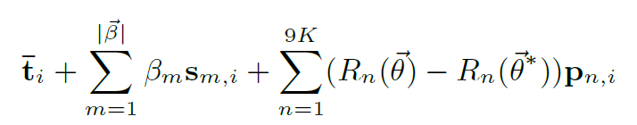

step2：修正节点位置

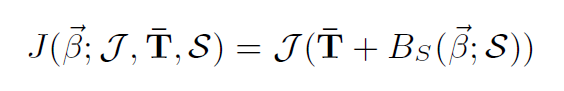

step3：蒙皮

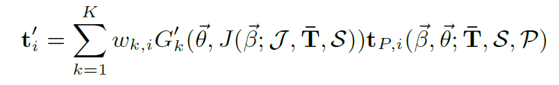

其中，i代表第i个顶点的序号，ti代表T的第i个元素，wi等以此类推

B（β）也就是blend shape偏移的第一部分：

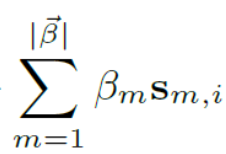

B（Θ）就是blend shape偏移的第二部分：

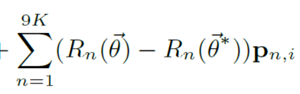

## 训练策略
JWP使用Multi-Pose dataset训练，因为他们时per-pose change的
T S使用multi-shape dataset训练，因为他们时per-shape change的

### JWP的loss
此时T S没有被学习，因此需要把rest pose下的顶点位置直接测量，记作T^p,他包括了T与B(S)的部分.
另外还接受测量的是每一个pose的节点位置,记做J^P
第一个loss是end-to-end loss,也就是实际顶点与预测顶点的欧氏距离的平方

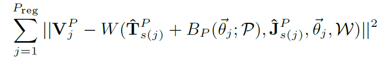

第二个loss是针对不同样本做平衡的loss,如果顶点和关节点的左右对称性较好,那么loss会更低.

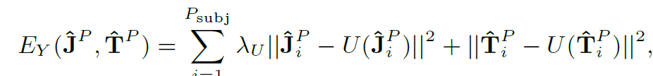

第三个loss是针对J权重，要求J对于骨骼位置的修正效果够好

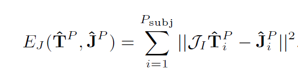

最后两个loss是正则化的loss，要求 P权重逼近于0，以及蒙皮权重相对于初始权重正则化0。

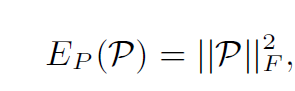

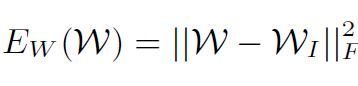

### S和T的训练

在训练S和T之前，一个问题是如何得到一个输入θ，直观的想法是直接测量当前样本的θ。但是为了保证训练得到的T在不同的pose之间有鲁棒性，作者将multi-pose 数据集的结果归一化到rest pose计算了平均的顶点位置 T_μ与平均的节点位置J_μ。
针对multi-shape数据集中的每一个样本，作者带入了T_μ与J_μ，并且取了能够使得顶点偏移最小化的θ为输入.

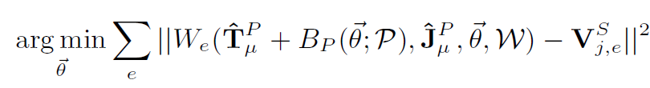

在确认输入θ后，便可以计算最优的rest-pose顶点位置。

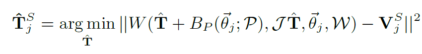

接着对所有的rest-pose顶点位置做主成分分析，可以计算出最佳 rest-pose的归一化顶点位置，以及参数S

## 疑惑
1 LBS方法的问题是关节旋转时会变形，可是为什么会这样呢？
2 frobenius函数是什么。
3 为什么J要设置为non-negtive
4 PCA在shape parameter train中的如何得到S以及T是什么？

## todo
1 看代码，消除自己的理解里面模糊的部分，比如说各个节点坐标系是怎么定义的，权重实际意义，对我来说还很模糊。
2 补足相关知识： PCA(机器学习课讲过，但是忘了实现的具体步骤)，frobenius

