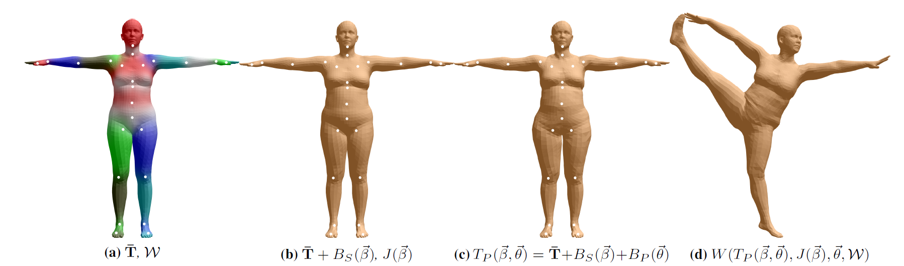

```
<script id="MathJax-script" async src="https://cdn.jsdelivr.net/npm/mathjax@3/es5/tex-mml-chtml.js"></script>
```

## 三维人体重建任务
与感知任务相比，三维重建任务在输入和输出上相反。三维重建任务多是在已经对场景（或人）有了语义上的理解后，预测视觉传感器会收集到的数据。

以三维人体重建任务根据已知的动作预测人体软组织的形状。首先把重建的结果拆分为一个可以量化的数学模型，这个数学模型由人体的关节和软组织组成。其中关节的运动由骨骼牵引，可以被视作刚体的运动。但是软组织会随着人体位姿的变化而改变形状，这是一个复杂的预测过程。

## 蒙皮重建方法
我正在pre-research的是蒙皮重建方法，它把软组织建模成许多个顶点，并且对于关节有着依附的关系。因此，三维人体的重建任务被转化成了预测多个顶点的三维位置。而三维重建模型，就成为了输入一个人的运动姿态以及人类的体型，依据通过训练得到的权重，预测运动姿态下软组织分布的推理模型。

以工作SMPL为例，人体被划分为6890个顶点以及23个关节点。模型的输出是6890个顶点的三维坐标，表示为尺寸是6890*3的一个张量。

#### Linear Blend Skinning

$$
\vec{v}*c = \sum*{i = 1}^{n} w_i M_{i,c} M_{i,d}^{-1} \vec{v}_d
$$

$V_d$是休息姿态下的顶点坐标，是一个6890×3的矩阵,$M_{i,d}^{-1} $是在静态下，将顶点坐标转换到关节i的转换矩阵，$M_{i,c}$是在pose的影响下，关节点相对于rest-pose时的转换矩阵，$w_{i}$是各个关节点对于顶点移动的权重

## SMPL
因此，研究人员通过引入先验的经验，把这种end-to-end的推理过程进行拆分，成为多个网络，让模型的一些网络具有通用性：
①比如所有建模的结果都是6890块顶点，如果所有模特按照rest pose 站立，那么这些顶点的分布十分相似
②比如如果所有模特们都做相同的动作，那么模特们的软组织会有相似的变形，顶点的偏移也是相似的。
③做出相同的动作时，蒙皮的权重是相似的。

经过分解后，3D重建的输出结果可以看成是多个偏移施加在一个基础的T型蒙皮的modal上。这些偏移包括：
①模特的身材对顶点造成的偏移
②模特的动作造成软组织的形变，带来的顶点偏移
③模特的动作造成骨骼的刚体旋转，带来的顶点偏移

下面这张图展示了加入三个偏移对于重建结果的影响：


## 模型
#### 模型的输入参数：

$\beta$，模特的体态参数。在multi-shape的数据集上，对于各个shape的样本的扫描数据应用PCA后，得到十个主成分特征向量。并由此，将新的模特数据投影到特征向量上

$\theta$是关节坐标系之间的旋转角差值，由72个数组成，69是每一个关节点坐标系相对父关节点坐标系偏移，另外3个数字是根节点坐标系与世界坐标系的偏移。每一个节点下链接一个部位。因此θ可以理解为骨骼的旋转角度。

#### 中间变量：

$B_S(\vec{\beta})$是由体态参数造成的顶点偏移,也是Principal Component Scores

$B_P(\vec{\theta})$代表由位姿带来的顶点偏移，

$R_{n}(\vec{\theta})$代表每一个节点相对于父节点的旋转矩阵，尺寸是3×3×k，扁平化后是9×k

$R_{n}(\vec{\theta}^{*})$代表的是rest pose时，每一个节点相对于父节点的旋转矩阵，尺寸一样

$T_P$代表经过blend shape parameter和pose修正后的，“修正rest pose”上顶点的位置，也是PCA处理后的重构数据。

#### 模型的权重：

$S_n$是由multi_shape数据集上经过PCA得到的特征向量

$P_n$ 用于加权位姿对于blend shape的偏移，矩阵尺寸是3N×|R|=3N×9×k

$J$用于由顶点位置回归到关节点位置。

$W$ 蒙皮权重

$T$ 是rest pose下的顶点分布，同时也是PCA中的均值

#### 推理流程：

step1：重构SMPL的rest pose

首先计算Principal Component Scores，结果可以视作体型对于rest pose上顶点的偏移。
$$
B_{S}(\vec{\beta}) = \sum_{n = 1}^{|\beta| = 300} \beta_{n} S_{n}, \text{ where } S_{n} \in R^{3N\times300}
$$
经过体型修正的rest pose下的顶点是
$$
T_{S} = T + B_{S}(\vec{\beta}), \text{ where } T \in R^{3N}
$$


同时，根据修正后的rest pose，可以推理出关节点的位置
$$
J(\vec{\beta}; \mathcal{J}, \overline{\mathbf{T}}, \mathcal{S}) = \mathcal{J}(\overline{\mathbf{T}} + B_S(\vec{\beta}; \mathcal{S}))
$$
step2：计算全新的pose下，会对顶点带来的影响。但是，这是在rest pose上做的顶点偏移。
$$
\overline{\mathbf{t}}_i + \sum_{m = 1}^{|\vec{\beta}|} \beta_m \mathbf{s}_{m,i} + \sum_{n = 1}^{9K} (R_n(\vec{\theta}) - R_n(\vec{\theta}^*)) \mathbf{p}_{n,i}
$$
step3：按权重蒙皮
$$
\mathbf{t}'_i = \sum_{k = 1}^{K} w_{k,i} G'_k(\vec{\theta}, J(\vec{\beta}; \mathcal{J}, \overline{\mathbf{T}}, \mathcal{S})) \mathbf{t}_{P,i}(\vec{\beta}, \vec{\theta}; \overline{\mathbf{T}}, \mathcal{S}, \mathcal{P})
$$

## 训练策略
JWP使用Multi-Pose dataset训练。
T S在Multi-shape dataset上进行PCA处理得到。

#### JWP的训练
此时T S没有被学习，因此对于dataset中的每一个样本，直接测量rest pose下的顶点位置，记为$\hat{\mathbf{T}}_{i}^{P}$
另外还测量的是每一个样本的关节点，记做$\hat{\mathbf{J}}_{i}^{P}$

第一个loss是end-to-end loss,也就是,经过smpl重建后的顶点位置与实际顶点位置的欧氏距离的平方之和
$$
\sum_{j = 1}^{P_{\text{reg}}} \left\lVert \mathbf{V}_j^P - W(\hat{\mathbf{T}}_{s(j)}^P + B_P(\vec{\theta}_j; \mathcal{P}), \hat{\mathbf{J}}_{s(j)}^P, \vec{\theta}_j, \mathcal{W}) \right\rVert^2
$$
第二个loss是样本平衡的loss,如果顶点和关节点的左右对称性较好,那么loss会更低.
$$
E_Y(\hat{\mathbf{J}}^P, \hat{\mathbf{T}}^P) = \sum_{i = 1}^{P_{\text{subj}}} \lambda_U \left\lVert \hat{\mathbf{J}}_i^P - U(\hat{\mathbf{J}}_i^P) \right\rVert^2 + \left\lVert \hat{\mathbf{T}}_i^P - U(\hat{\mathbf{T}}_i^P) \right\rVert^2
$$
第三个loss是针对J权重
$$
E_J(\hat{\mathbf{T}}^P, \hat{\mathbf{J}}^P) = \sum_{i = 1}^{P_{\text{subj}}} \left\lVert \mathcal{J}_I \hat{\mathbf{T}}_i^P - \hat{\mathbf{J}}_i^P \right\rVert^2
$$
最后两个loss是正则化的loss
$$
E_P(\mathcal{P}) = \|\mathcal{P}\|_F^2
$$

$$
E_W(\mathcal{W}) = \|\mathcal{W} - \mathcal{W}_I\|_F^2
$$

### 使用PCA获得S和T

作者将multi-pose 数据集的结果归一化到rest pose计算了平均的顶点位置 $\hat{\mathbf{T}}_{\mu}^{P}$与平均的节点位置$\hat{\mathbf{J}}_{\mu}^{P}$。
针对multi-shape数据集中的每一个样本，作者带入了$\hat{\mathbf{T}}_{\mu}^{P}$与$\hat{\mathbf{J}}_{\mu}^{P}$，并且取了能够使得顶点偏移最小化的θ为输入.
$$
\arg\min_{\vec{\theta}} \sum_{e} \left\|W_e(\hat{\mathbf{T}}_{\mu}^{P}+B_{P}(\vec{\theta};\mathcal{P}),\hat{\mathbf{J}}_{\mu}^{P},\vec{\theta},\mathcal{W})-\mathbf{V}_{j,e}^{S}\right\|^2
$$
在确认输入θ后，便可以计算最优的rest-pose顶点位置。
$$
\hat{\mathbf{T}}_{j}^{S} = \arg\min_{\hat{\mathbf{T}}} \left\|W(\hat{\mathbf{T}} + B_{P}(\vec{\theta}_{j};\mathcal{P}),\mathcal{J}\hat{\mathbf{T}},\vec{\theta}_{j},\mathcal{W}) - \mathbf{V}_{j}^{S}\right\|^2
$$
接着，对所有在Multi-shape dataset中样本的rest-pose顶点位置做主成分分析，将均值作为最后的结果T，并且计算特征向量S


